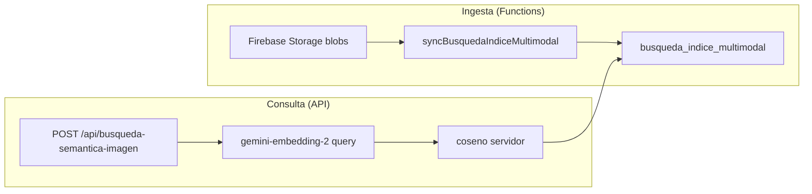

# Búsqueda semántica multimodal — diseño preliminar

Fecha: 2026-08-18 · Relacionado: [2026-08-18-modelos-gemini-alineacion.md](./2026-08-18-modelos-gemini-alineacion.md)

## Problema

El índice `busqueda_indice` hoy indexa **texto** (descripciones de órdenes y proveedores) con `gemini-embedding-2` a 768 dimensiones. Operadores del taller a veces quieren buscar por **foto** (“esta fresa”, “esta pieza”) sin conocer el número de parte.

`gemini-embedding-2` GA soporta imagen, PDF, audio y video en el mismo espacio vectorial que el texto.

## Objetivo

Permitir en Cmd+K (o módulo dedicado) subir una imagen y recuperar ítems similares del catálogo/endmills/órdenes.

## Alcance v1 (MVP)

1. **Consulta multimodal en vivo** — embed de la foto del usuario con prefijo query; comparar contra índice existente **solo si** los documentos indexados también tienen embedding multimodal (hoy no).
2. **Sin mezclar vectores** — texto-only vs imagen-only embeddings pueden no ser comparables en el mismo índice; validar con corpus de prueba antes de producción.

## Pipeline propuesto

### Ingesta

- Fuente inicial: fotos de endmills en Storage (`endmills/` prefix) + thumbnail opcional de facturas ya subidas.
- Campo nuevo en índice: `modalidad: "texto" | "imagen"`, `storagePath`, `embedding` (768d).
- Reutilizar batches de **100** escrituras Firestore (límite 10 MiB/transacción).
- Secreto: `HUB_GEMINI_API_KEY` (mismo que índice textual).

### API

- `POST /api/busqueda-semantica-imagen` — auth + permisos `ordenes`/`proveedores`/`endmills`.
- Body: imagen base64 + mime; máx 4 MB.
- Respuesta: top-N con score, enlace al documento fuente.

### Permisos

- Reglas Firestore: colección separada o subcolección; cliente sin acceso directo (patrón actual de `busqueda_indice`).

## Alternativa: File Search (RAG gestionado)

Google File Search indexa PDFs/imágenes en un store gestionado. Pros: menos código de índice. Contras: costo mensual por store, permisos multi-tenant SMV, no integrado con coseno local actual.

**Recomendación:** mantener índice propio si ya invertiste en `busqueda_indice`; evaluar File Search solo para “preguntas sobre historial de facturas PDF” sin ranking numérico.

## Riesgos

| Riesgo | Mitigación |
|--------|------------|
| Vectores texto vs imagen incomparables | Benchmark 50 pares foto↔descripción antes de merge |
| Costo de reindex con blobs | Indexar solo endmills + muestra; no full Storage scan |
| Latencia upload | Límite tamaño; resize server-side a 512px |
| Cambio de modelo embedding | Reindex completo obligatorio |

## Criterios de aceptación (futuro)

- [ ] 10 fotos de endmills de prueba: top-3 incluye medida correcta en ≥8/10
- [ ] Sin regresión en búsqueda textual existente
- [ ] Tests Vitest para embed multimodal mock + permisos API
- [ ] Documentar en AGENTS.md tras deploy

## Fuera de alcance v1

- Indexar audio/video de taller
- Búsqueda híbrida texto+foto en una sola query
- Reemplazar `/api/scrape` por URL context de Gemini
